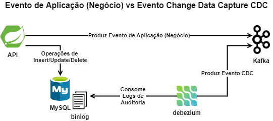

# Exemplo de API - Expondo Eventos de Aplicação (Negócio) vs Eventos Change Data Capture - CDC

Este **Exemplo de API** tem como objetivo mostrar as **diferenças** entre expor **eventos**.

> - Eventos de banco de dados através **Change Data Capture - CDC**
>   - Serão expostos no **Kakfa** os eventos de **insert, update e delete** de uma **tabela**

> - Eventos de **Aplicação (Negócio)**
>   - Serão expostos no **Kakfa** os eventos de **post, put, delete e erros** de um **domínio/entidade**

***

## Arquitetura



> No nosso laborário, a execução de todos os componentes acima são orquestradas pelo docker. 

***

## Pré requisitos
- Java 8
- Maven 3
- Scala 2.13.5
- docker
- docker-compose

***

## Profiles

A aplicação suporta os seguintes profiles:
- **local**: ambiente desenvolvimento local;
- **docker**: ambiente de demonstração

### Profile local

Ambiente de desenvolvimento, é requisito que o `docker-compose-profile-local` esteja rodadando

Este profile está ligado é o `default`

***

## Como executar o docker-componse

Via terminar, navegar até o docker-componse desejado:
- docker-compose-profile-docker
- docker-compose-profile-local

```shell
docker-compose -f docker-compose.yaml up
```

Usar a opção `-d` para rodar em segundo plano (background)

```shell
docker-compose -f docker-compose.yaml up -d
```

## Como compilar a aplicação

Executar o comando abaixo:
```shell
mvn clean install 
```
O jar gerado conterá todas as dependências do projeto.

## Montar a imagem `exemplo-api:latest`

Pré-requisito:

- Ter executado o passo **Como compilar a aplicação**

Executar o comando abaixo no terminal:
```shell
mvn docker:build 
```
## Executar a aplicação

Pré-requisito:

- Ter executado o passo **Como compilar a aplicação**
- Ter executado o passo **Como executar o docker-componse**

Executar o comando abaixo:
```shell
mvn spring-boot:run 
```

> Entrar neste link após inicialização da aplicação: [swagger-ui.html](http://localhost:8080/swagger-ui.html)

***

## Como ativar o CDC (change data capture)  via Debezium

Pré-requisito:

- Ter executado o passo **Como executar o docker-componse**

- Ter executado o passo **Executar a aplicação**. No bootstrap da aplicação a tabela `contato_entity` será criada.

> Utilizar o aplicativo de sua preferência executar o comandos abaixo

### MySQL - root 

Executar a sequencia de comandos no terminal

1. Acessar o terminal do container do mysql
```shell
docker exec -it mysql bash
```
2. Conectar no mysql
```shell
mysql -uroot -pexemploapi
```
3. Conectar no mysql
```shell
ALTER USER 'root'@'%' IDENTIFIED WITH mysql_native_password BY 'exemploapi';
FLUSH PRIVILEGES;
```

### Kafka Connect - Status

- Requisição
  - **método**: GET
  - **url**: http://localhost:8083/

- Exemplo de resposta:
```json
{
    "version": "2.6.1",
    "commit": "6b2021cd52659cef",
    "kafka_cluster_id": "ua7kR0awQleslDTRQFCr_g"
}
```

### Kafka Connect - Lista de Conectores

- Requisição
  - **método**: GET
  - **url**: http://localhost:8083/connectors/

- Exemplo de resposta, quando não tem conectores cadastrados:
```json
[]
```

### Kafka Connect - Cadastrar um Conector

O usuário precisa ter permissão de **root**. Como o nosso caso de uso é o **mysql**.

Executar como comando abaixo no **mysql** para habilitar que seja possível conectar usando o **root**.

- Requisição
    - **método**: POST
    - **url**: http://localhost:8083/connectors/
    - **header**: Accept:application/json
    - **header**: Content-Type:application/json
    - **body**: json abaixo
```json
{
  "name": "exemplodb-connector",
  "config": {
    "connector.class": "io.debezium.connector.mysql.MySqlConnector",
    "tasks.max": "1",
    "database.hostname": "mysql",
    "database.port": "3306",
    "database.user": "root",
    "database.password": "exemploapi",
    "database.server.id": "184054",
    "database.server.name": "mysql",
    "database.whitelist": "exemplodb",
    "database.history.kafka.bootstrap.servers": "kafka:29092",
    "database.history.kafka.topic": "dbhistory.exemplodb"
  }
}
```
- Exemplo de resposta de sucesso:
```json
{
  "name": "exemplodb-connector",
  "config": {
    "connector.class": "io.debezium.connector.mysql.MySqlConnector",
    "tasks.max": "1",
    "database.hostname": "mysql",
    "database.port": "3306",
    "database.user": "root",
    "database.password": "exemploapi",
    "database.server.id": "184054",
    "database.server.name": "mysql",
    "database.whitelist": "exemplodb",
    "database.history.kafka.bootstrap.servers": "kafka:29092",
    "database.history.kafka.topic": "dbhistory.exemplodb",
    "name": "exemplodb-connector"
  },
  "tasks": [],
  "type": "source"
}
```

***

## Kafka

Executar a sequencia de comandos no terminal

1. Acessar o terminal do container do kafka
```shell
docker exec -it kafka bash
```

### Listar os tópicos 

Pré-requisito:

- Ter executado o passo **1. Acessar o terminal do container do kafka**

Executar o comando 
```
kafka-topics --bootstrap-server :9092 --list
```

### Descrever os detalhes do tópico

Pré-requisito:

- Ter executado o passo **1. Acessar o terminal do container do kafka**

Executar o comando
```
kafka-topics --bootstrap-server :9092 --describe --topic contatos
```

### Consumir os dados do tópico

Pré-requisito:

- Ter executado o passo **1. Acessar o terminal do container do kafka**

Executar o comando
```
kafka-console-consumer --from-beginning --bootstrap-server :9092 --topic contatos
```

## Firewall

Lista de serviços / portas:

Serviço|Porta
---- | ----
Zookeeper|2181
Kafka|9092
MySQL|3306
Debezium Kafka Connector|8083
Exemplo API|8080

## Contribuições são bem-vindas 💜

Levante um problema para discutir suas sugestões ou abra um `Pull Request` para solicitar melhorias.

## Reviewers 🔎

[comment]: <> (Muito obrigado para [@dancarv]&#40;https://github.com/dancarv&#41; e [@schmidt-samuel]&#40;https://github.com/schmidt-samuel&#41; por revisar este projeto.)

## Referencias 🔥
- https://debezium.io/documentation/reference/tutorial.html
- http://kafka.apache.org/quickstart
- https://spring.io/projects/spring-hateoas
- https://spring.io/projects/spring-restdocs
- https://spring.io/projects/spring-data-jpa

## Licença 🗞

> Copyright © 2021
